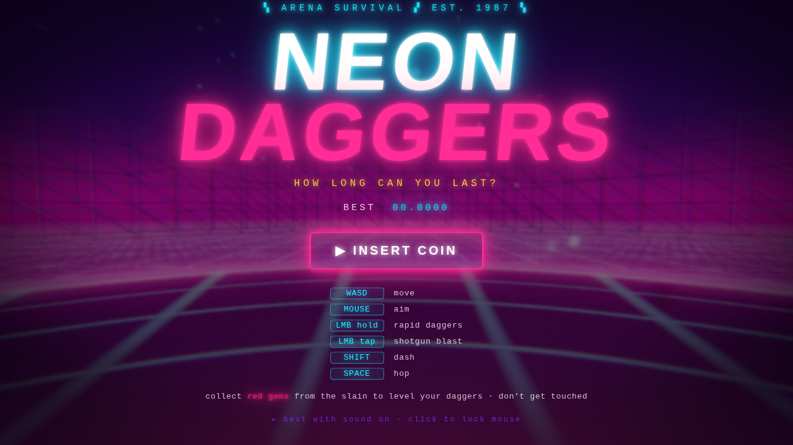

# NEON DAGGERS // 1987

An **80s synthwave arena-survival shooter** in the spirit of *Devil Daggers*, drenched
in *Hotline Miami* neon. Stand on a floating chrome dais above an infinite grid,
hold back an endless, escalating tide of glowing geometric horrors, and chase the
clock to four decimal places. One touch and the signal dies.



> Built with **Three.js** + the Web Audio API. No art or audio assets — every
> visual is shader/geometry-driven and every sound is synthesized at runtime.

---

## Play

```bash
npm install
npm run dev      # open the printed http://localhost:5173 URL
```

Production build:

```bash
npm run build    # outputs ./dist (static, relative paths — host it anywhere)
npm run preview
```

Click **INSERT COIN** to lock the mouse and begin.

### Controls

| Input | Action |
| --- | --- |
| `W A S D` | move (fast, strafe-heavy) |
| `Mouse` | aim |
| `Left Mouse` (tap) | shotgun blast of daggers |
| `Left Mouse` (hold) | rapid dagger stream |
| `Shift` | dash |
| `Space` | hop |
| `Esc` | pause (release mouse) |
| `R` / `Space` | retry on the death screen |
| `M` | toggle music |

### How to last

- **Kill to grow.** Slain enemies cough up **red gems** that magnetize to you.
  Banking gems levels your daggers five times over — more pellets, more damage,
  and **homing** at the higher tiers.
- **Keep moving.** Everything homes on you. Kite the swarm into your line of fire;
  never stand still.
- **Watch the edges.** Chargers wind up and lunge. Spawners birth swarmers and
  burst into four more when they die.
- **Survival time is the score.** It's tracked to 1/10000th of a second, just like
  the game that inspired it. Your best is saved locally.

---

## What's under the hood

A small, dependency-light engine split into focused modules:

| Module | Responsibility |
| --- | --- |
| `renderer.js` | WebGL renderer + post pipeline: **UnrealBloom** → tonemap → custom **CRT/VHS** pass (barrel curve, radial chromatic aberration, rolling scanlines, grain, vignette, trauma-driven chroma tearing). |
| `world.js` | The vista: shader **neon grid**, banded **retro sun**, star sky-dome, wireframe **mountains**, the floating **arena pad**, drifting embers. All beat-reactive. |
| `player.js` | First-person controller — acceleration/friction strafe, dash, hop, head-bob, strafe-roll, the eye transform the camera rides. |
| `weapons.js` | Instanced **dagger** projectiles, shotgun-tap / rapid-hold firing, five upgrade tiers with homing. |
| `enemies.js` | Four neon archetypes (skull, swarmer, charger, spawner) with distinct AI, fresnel-rim bodies + glowing wireframe edges, hit-flash, splitting. |
| `director.js` | Procedural escalation — introduces enemy types over time, grows the live population, punctuates with wave bursts. |
| `gems.js` | Instanced gem drops with magnet collection feeding the upgrade meter. |
| `particles.js` | Pooled additive point-sprite bursts (muzzle, sparks, deaths, the player-death supernova). |
| `audio.js` | Fully **procedural synthwave**: four-on-the-floor drums, saw bass, delayed lead arp and pad that layer in with intensity, plus a SFX bank. Drives the visual beat. |
| `hud.js` / `game.js` | Neon DOM HUD, screens, and the state machine / main loop wiring it all together (collisions, scoring, combo, screen-shake, slow-mo death). |

### Game feel

Screen-shake (camera **and** chromatic-aberration "trauma"), hit-flashes,
particle bursts, muzzle flashes, a red damage vignette, a danger pulse when an
enemy is breathing down your neck, kill combos, camera bob + strafe roll, and a
desaturating **slow-motion death** cam. The world pulses to the kick drum.

---

## Notes

- Best experienced fullscreen with sound on. Requires a WebGL2 browser and pointer-lock.
- Fonts load from Google Fonts when online and fall back to system faces offline.
- `tools/` holds the headless-Chromium screenshot/verification scripts used during
  development (they expect a local `playwright`); they are not needed to play.
- `?bot` in the URL runs a self-playing attract/verification mode.

Survive. Bank gems. Chase the clock. **One more try.**
